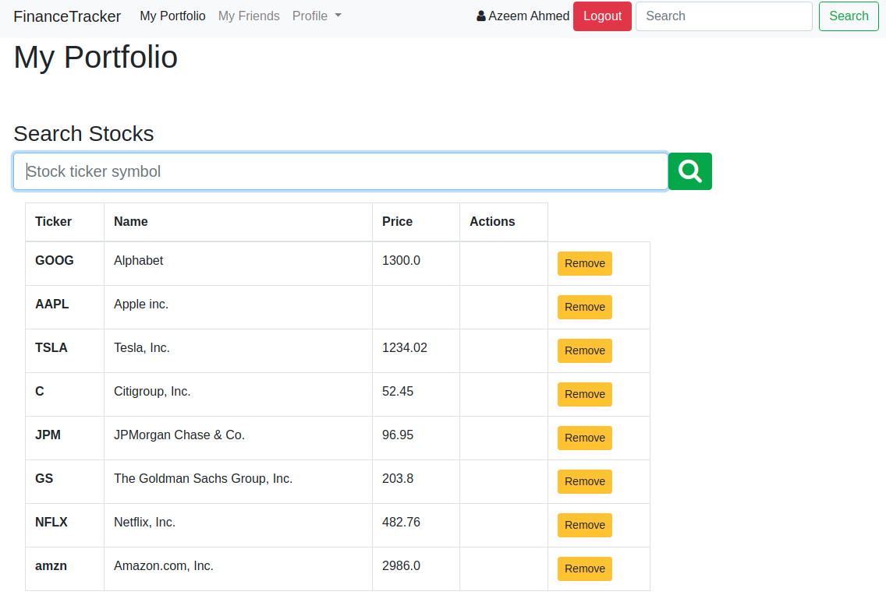
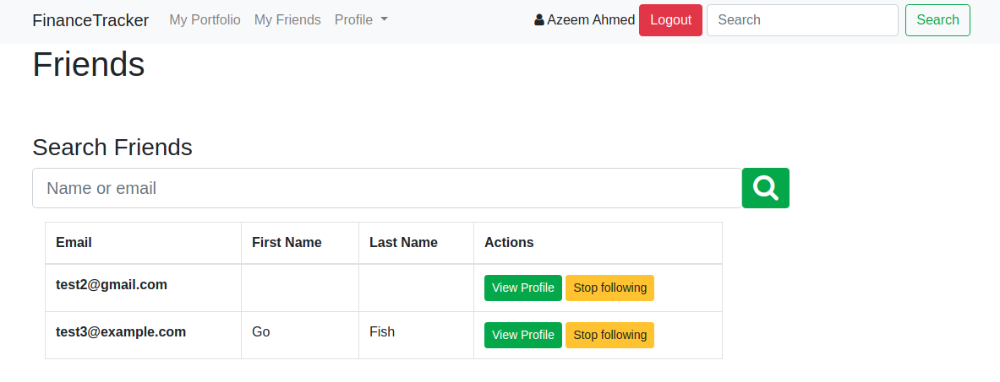

# Finance Tracker - Track stocks and see your friends stocks!

> Track stocks, add them to your portfolio and see which stocks your friends are following!

Created with Ruby on Rails.

## Built With

- Ruby on Rails
- Devise Gem for authentication
- Bootstrap for styling
- Bullet gem for N+1 query errors
- IEX-ruby-client
- Databases: SQLite3 in development and testing, PostgresQL for production

## Live Demo

- [Live Demo Link](https://dry-bayou-23499.herokuapp.com/)

## Getting Started

To get a local copy up and running follow these simple example steps.

### Prerequisites

1. Have ruby installd
2. Have Rails 6 insalled

### Setup

1. Clone this repo to your computer using <code>git clone</code> and the web url
2. Open your terminal and <code>cd</code> into the project root directory

### Install

1. Run <code>bundle install</code>
2. Install yarn packages as the terminal will prompt you to do
3. Run <code>rails db:create</code>
4. Run <code>rails db:migrate</code>
5. Run <code>Rails s</code> to start the server

### Usage

1. Open your browser at <code>localhost:3000</code>
2. Sign up and start Tracking stocks!

## Authors

👤 **Azeem Ahmed**

- Github: [@Azeem838](https://github.com/Azeem838)
- LinkedIn: [Azeem Ahmed](https://www.linkedin.com/in/azeem-ahmed-a56a25101/)

## 🤝 Contributing

Contributions, issues and feature requests are welcome!

Feel free to check the [issues page](https://github.com/Azeem838/finance-tracker/issues).

## Show your support

Give a ⭐️ if you like this project!

## 📝 License

This project is [MIT](lic.url) licensed.
